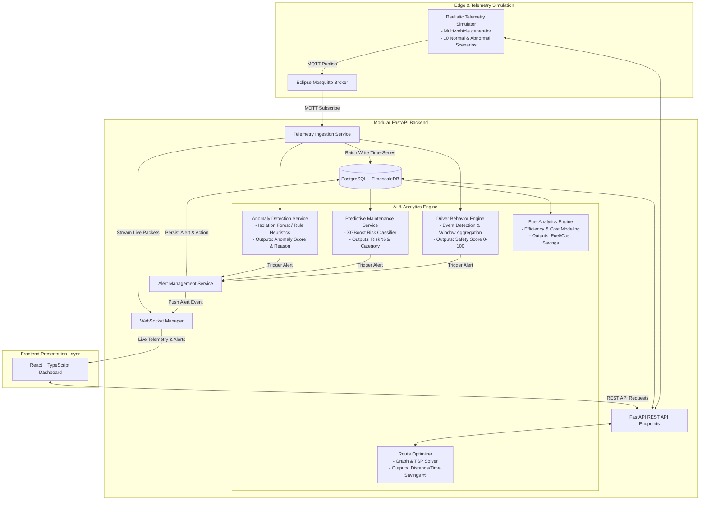
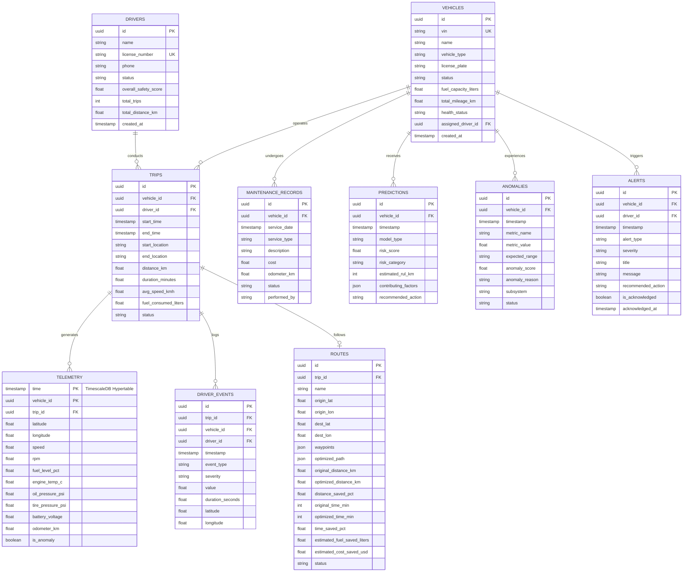
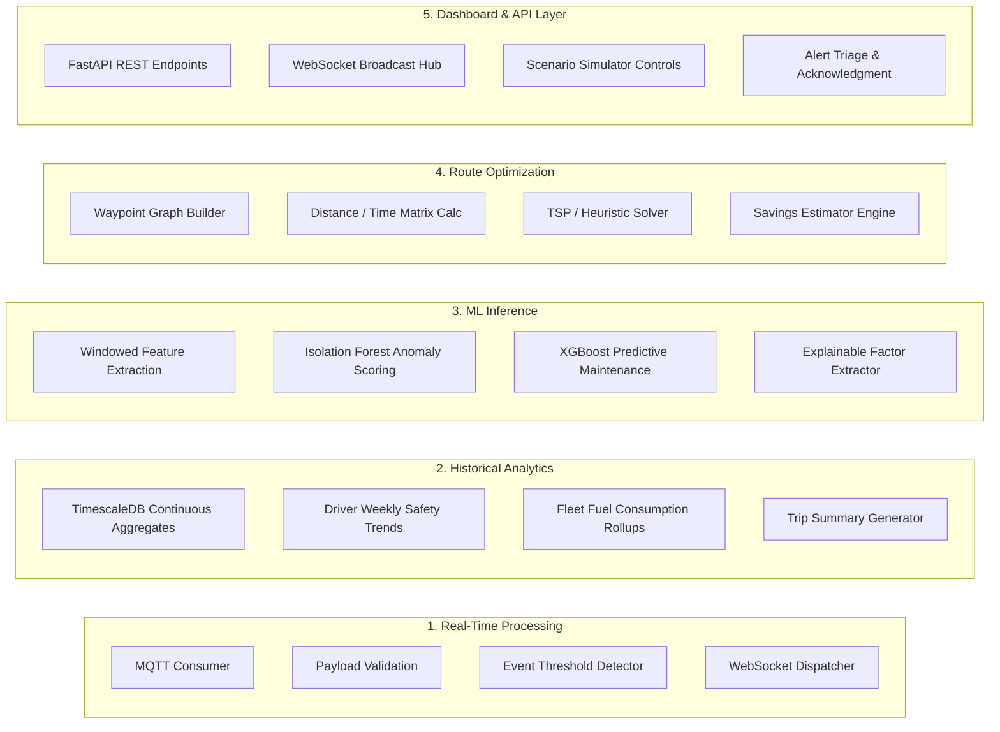
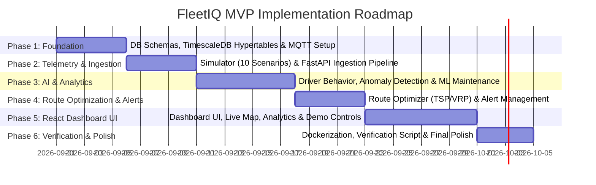

# FleetIQ – AI-Powered Fleet Intelligence & Optimization Platform
## Project Plan & Architectural Specification (MVP-First Prototype)

---

### 1. Executive Summary & Project Goals
**FleetIQ** is an AI-powered fleet intelligence and optimization platform designed to provide real-time visibility, predictive diagnostics, driver safety analytics, and algorithmic route optimization for commercial and logistics fleets.

This project plan prioritizes a **polished, fully working end-to-end prototype** tailored for a college capstone/engineering project. It delivers complete functionality across all core pillars with demonstrable AI outputs, realistic telemetry simulation, and clean architecture without unnecessary microservice overhead.

#### Primary MVP Objectives:
1. **Real-Time Telemetry Streaming:** Stream and visualize high-frequency vehicle telemetry (speed, RPM, fuel level, engine temperature, oil pressure, tire pressure, GPS coordinates) via MQTT.
2. **Driver Behavior Analysis & Scoring:** Detect distinct driving events (harsh braking, rapid acceleration, overspeeding, sharp turns, excessive idling) and compute normalized 0–100 driver safety scores.
3. **Predictive Maintenance Risk Scoring:** Predict component failure probability, maintenance urgency percentage, and risk categories (Low, Medium, High, Critical) using machine learning (scikit-learn / XGBoost).
4. **Telemetry Anomaly Detection:** Detect sensor malfunctions and operating anomalies in real time with interpretable anomaly scores and explicit root-cause explanations.
5. **Fuel Efficiency Analytics:** Analyze consumption trends, correlate speed/RPM/idle times with fuel usage, and surface actionable fuel and cost savings.
6. **Algorithmic Route Optimization:** Optimize multi-stop delivery routes using graph and optimization algorithms, demonstrating measurable reductions in distance, transit time, and fuel.
7. **Actionable Fleet Alerts:** Generate real-time priority alerts with severity classification and contextual recommended actions for fleet operators.
8. **Professional React Dashboard:** Provide a responsive, high-performance React + TypeScript interface featuring a live fleet map, analytical scorecards, alert feed, and an interactive demonstration control panel.

---

### 2. Technology Stack

| Layer | Technology | Role / Purpose |
| :--- | :--- | :--- |
| **Frontend** | React, TypeScript, Vite, TailwindCSS / CSS Modules, Lucide Icons, Leaflet / MapLibre, Recharts | Fleet management dashboard, real-time map, interactive charts, scenario trigger panel |
| **Backend** | Python 3.11+, FastAPI, Pydantic v2, SQLAlchemy 2.0 | Async REST API, WebSocket streaming server, telemetry ingestion pipeline |
| **Telemetry Broker** | Eclipse Mosquitto (MQTT) | Lightweight pub/sub messaging broker for vehicle telemetry streams |
| **Database** | PostgreSQL 16 + TimescaleDB Extension | Relational metadata storage paired with time-series hypertables for telemetry |
| **AI / Machine Learning** | Python, scikit-learn, XGBoost, NumPy, Pandas | Supervised predictive maintenance, unsupervised anomaly detection (Isolation Forest / Autoencoder), feature extraction |
| **Route Optimization** | Python, NetworkX / SciPy / OR-Tools | Graph modeling, shortest-path calculation (Dijkstra/A*), and Vehicle Routing / TSP heuristics |
| **Containerization** | Docker, Docker Compose | Practical multi-container local deployment (`db`, `broker`, `backend`, `frontend`) |
| **Version Control** | Git | Source code and configuration management |

---

### 3. MVP-First System Architecture

The system uses a **modular monolithic backend** pattern with clean layer boundaries. This avoids distributed microservice complexity while keeping ingestion, AI inference, business logic, and API servicing cleanly decoupled.



---

### 4. Demonstrable & Interpretable AI Functionality

Every AI and analytical component must generate **transparent, human-interpretable outputs** that can be directly inspected in the UI and evaluated by reviewers:

```mermaid
classDiagram
    class PredictiveMaintenanceOutput {
        +float risk_percentage "e.g. 84.5%"
        +string risk_category "CRITICAL | HIGH | MEDIUM | LOW"
        +int estimated_rul_km "e.g. 240 km"
        +list contributing_factors "['High Coolant Temp (114°C)', 'Low Oil Pressure (22 PSI)']"
        +string recommended_action "Immediate inspection of cooling loop required"
    }

    class DriverSafetyOutput {
        +int safety_score "e.g. 64 / 100"
        +string risk_level "HIGH_RISK | MODERATE | SAFE"
        +int harsh_brake_count "5 events"
        +int rapid_accel_count "4 events"
        +int overspeed_minutes "12 min"
        +int idle_minutes "18 min"
        +list key_deductions "['-15 pts: 5 Harsh Braking', '-10 pts: 12m Overspeeding']"
    }

    class AnomalyDetectionOutput {
        +boolean is_anomaly "true"
        +float anomaly_score "0.93 (Threshold: 0.70)"
        +string anomaly_reason "Engine Coolant Temp (118°C) exceeds 99th percentile with abnormal RPM (3800)"
        +string affected_subsystem "POWERTRAIN_COOLING"
    }

    class RouteOptimizationOutput {
        +float original_distance_km "48.2 km"
        +float optimized_distance_km "39.1 km"
        +float distance_saved_pct "18.9%"
        +int original_time_min "62 min"
        +int optimized_time_min "47 min"
        +float time_saved_pct "24.2%"
        +float estimated_fuel_saved_liters "2.1 L"
        +float estimated_cost_saved_usd "$4.85"
    }

    class FuelAnalyticsOutput {
        +float current_consumption_l_100km "14.8 L/100km"
        +float fleet_benchmark_l_100km "11.2 L/100km"
        +float idle_fuel_loss_liters "3.4 L"
        +float potential_monthly_savings_usd "$420.00"
        +string primary_inefficiency "Excessive idle time (24% of trip duration)"
    }
```



---

### 5. Realistic Telemetry Simulator Specification

The simulator acts as a realistic virtual IoT edge generator, capable of streaming 5–10 concurrent simulated vehicles. It supports 10 distinct, switchable operational scenarios:

| Scenario | Simulated Telemetry Signature | Expected AI / Analytical Reaction |
| :--- | :--- | :--- |
| **1. Normal Highway Cruising** | Speed 80–100 km/h, RPM 1800–2200, Temp 88–92°C, Oil 45 PSI, Tire 34 PSI | Safety Score: 95+, Anomaly: False, Maint Risk: < 15% |
| **2. Normal Urban Driving** | Speed 20–50 km/h, frequent stop-and-go with gentle deceleration, Temp 90–94°C | Safety Score: 90+, Fuel: Normal urban baseline |
| **3. Harsh Braking Event** | Deceleration > 14 km/h per second, Speed drops abruptly from 60 to 0 km/h | Driver Event: `HARSH_BRAKE`, -5 pts Safety Score, Alert generated |
| **4. Rapid Acceleration** | Acceleration > 15 km/h per second, RPM spikes to 4200+ | Driver Event: `RAPID_ACCEL`, -4 pts Safety Score |
| **5. Overspeeding** | Speed > 80 km/h in urban zone or > 120 km/h on highway for > 30 seconds | Driver Event: `OVERSPEEDING`, Warning alert, Safety score deduction |
| **6. Excessive Idling** | Speed = 0 km/h, RPM = 800, Fuel consumption continues, Duration > 5 minutes | Fuel Inefficiency Flag, Idle loss tracking, -3 pts Safety Score |
| **7. Engine Overheating Anomaly** | Coolant Temp ramps continuously 100°C $\rightarrow$ 118°C, RPM normal | Anomaly Score: > 0.90, Maint Risk: CRITICAL (85%+), Immediate alert |
| **8. Low Oil Pressure Anomaly** | Oil Pressure drops below 20 PSI while engine running at 2500 RPM | Anomaly Score: > 0.85, Critical Alert: "Low Oil Pressure / Engine Seizure Risk" |
| **9. Gradual Component Wear** | High mileage (180,000+ km), slight temperature drift, uneven tire pressure | Maint Risk: MEDIUM (55%), RUL prediction updated, Service scheduled |
| **10. Sensor Glitch / Malfunction** | Sudden frozen sensor value or impossible spike (e.g. Temp = -40°C or 250°C) | Anomaly Engine: Sensor Anomaly Flag, Sensor Diagnostic Alert |

---

### 6. Relational & Time-Series Data Model

The data layer cleanly combines relational fleet metadata with TimescaleDB hypertables for telemetry.



---

### 7. Clear Separation of Backend Responsibilities

To ensure clean engineering practices, responsibilities are segmented into 5 distinct execution domains:



1. **Real-Time Processing (< 100ms):** Ingests MQTT packets, validates schema, evaluates single-point threshold violations (e.g. speed > 100, harsh brake $\Delta v$), and broadcasts live coordinates to WebSocket subscribers.
2. **Historical Analytics (Batch / Aggregates):** Executes SQL aggregations over TimescaleDB for multi-trip statistics, driver score cards, fleet mileage distributions, and weekly fuel metrics.
3. **Machine Learning Inference (On-Demand / Windowed):** Computes rolling features (e.g. 5-minute moving average of temperature, variance of RPM, vibration index) and feeds trained scikit-learn/XGBoost models for anomaly scores and maintenance risk categories.
4. **Route Optimization (Interactive / Algorithmic):** Computes distance/time cost matrices for arbitrary delivery stops, solves TSP/VRP using Dijkstra / 2-opt / OR-Tools heuristics, and computes before/after comparative metrics.
5. **Dashboard & API Responsibilities:** Serves clean RESTful endpoints for CRUD operations and historical queries, maintains WebSocket client connections, and provides simulated scenario triggers.

---

### 8. End-to-End Demonstration Scenario

The platform supports a continuous, transparent demonstration flow that can be triggered directly from the React UI:

```mermaid
sequenceDiagram
    autonumber
    actor Evaluator as Fleet Evaluator / Manager
    participant UI as React Dashboard
    participant API as FastAPI Backend
    participant Sim as Telemetry Simulator
    participant Broker as MQTT Broker
    participant Ingest as Ingest & ML Engine
    participant DB as TimescaleDB

    Evaluator->>UI: Selects Vehicle VH-102 and clicks "Trigger Overheating Scenario"
    UI->>API: POST /api/v1/scenarios/trigger {vehicle_id: "VH-102", scenario: "ENGINE_OVERHEAT"}
    API->>Sim: Activate scenario state for VH-102
    
    loop Real-Time Telemetry Stream
        Sim->>Broker: Publish Telemetry (Temp: 112°C, RPM: 3400, Speed: 65 km/h)
        Broker->>Ingest: Stream packet
        Ingest->>DB: Insert into telemetry hypertable
        Ingest->>Ingest: ML Feature Extraction & Anomaly Inference
        Note over Ingest: Anomaly Score: 0.94<br/>Maint Risk: 88% (CRITICAL)
        Ingest->>DB: Store Anomaly & Prediction records
        Ingest->>DB: Insert CRITICAL Alert
        Ingest->>UI: WebSocket Push (Live Telemetry + Anomaly Alert)
    end
    
    UI->>UI: Vehicle marker turns Red on Live Map, Alert Banner pops up
    Evaluator->>UI: Clicks Alert: "Critical Overheating Risk on VH-102"
    UI->>UI: Displays Diagnosis Modal with:<br/>- Contributing Factors: Coolant Temp (112°C) + Low Oil Pressure<br/>- Recommended Action: Reroute to Service Hub 2 (3.8 km away)
    Evaluator->>UI: Clicks "Execute Recommended Action"
    UI->>API: POST /api/v1/routes/optimize-reroute {vehicle_id: "VH-102", hub_id: "HUB-02"}
    API->>UI: Returns optimized emergency route (-15 min arrival)
    UI->>Evaluator: Reroute visualized on map; Alert marked "Mitigated"
```

---

### 9. AI/ML Evaluation Strategy & Validation Metrics

To ensure academic and technical rigor, all AI/ML models are evaluated against defined benchmarks and split datasets:

| AI Module | Algorithm / Technique | Dataset & Split Strategy | Primary Evaluation Metrics | Target Academic Benchmark |
| :--- | :--- | :--- | :--- | :--- |
| **Predictive Maintenance** | XGBoost Classifier / Random Forest | 80/20 train/test split on synthetic multi-vehicle degradation cycles with 5-fold cross-validation | ROC-AUC, Precision, Recall, F1-Score, Brier Score (calibration) | $\text{ROC-AUC} \ge 0.90$, $\text{F1} \ge 0.85$ |
| **Anomaly Detection** | Isolation Forest + Dynamic Statistical Z-Score | Labeled normal vs. injected anomaly telemetry sequences (70/30 split) | Precision, Recall, F1-Score, False Positive Rate (FPR) | $\text{Precision} \ge 0.92$, $\text{Recall} \ge 0.88$, $\text{FPR} \le 0.05$ |
| **Driver Behavior Evaluation** | Heuristic window event tagging + composite score normalization | Ground-truth simulated driving scenarios (harsh brake, rapid accel, overspeed, idle) | Event Detection Accuracy, Confusion Matrix, Score Correlation with Violations | $100\%$ detection of calibrated events with zero false positives on normal cruising |
| **Route Optimization** | Dijkstra Shortest Path + 2-opt TSP / OR-Tools heuristic | Benchmark 5 to 15 waypoint delivery networks | % Distance Reduced, % Travel Time Saved, Fuel Saved (L), Compute Latency | $\ge 15\%$ distance reduction vs. unoptimized sequence, solver time $< 500\text{ms}$ |
| **Fuel Efficiency Modeling** | Empirical Speed-RPM-Load regression model | Synthetic driving cycles across vehicle weight classes | Mean Absolute Percentage Error (MAPE), Estimated Cost Accuracy | $\text{MAPE} \le 8\%$ vs. theoretical consumption |

---

### 10. Practical Docker Deployment (Student Project Scope)

A simple, robust `docker-compose.yml` ensures anyone can launch the full system with **a single command**:

```yaml
version: '3.8'

services:
  # 1. TimescaleDB (PostgreSQL 16 + Time-Series Extension)
  db:
    image: timescale/timescaledb:latest-pg16
    container_name: fleetiq-db
    environment:
      POSTGRES_DB: fleetiq_db
      POSTGRES_USER: fleetiq_user
      POSTGRES_PASSWORD: fleetiq_password
    ports:
      - "5432:5432"
    volumes:
      - tsdata:/var/lib/postgresql/data
      - ./backend/scripts/init_db.sql:/docker-entrypoint-initdb.d/init_db.sql

  # 2. MQTT Message Broker (Mosquitto)
  broker:
    image: eclipse-mosquitto:2.0
    container_name: fleetiq-broker
    ports:
      - "1883:1883"
      - "9001:9001"
    volumes:
      - ./backend/config/mosquitto.conf:/mosquitto/config/mosquitto.conf

  # 3. Backend (FastAPI + Simulator + ML Ingestion)
  backend:
    build:
      context: ./backend
      dockerfile: Dockerfile
    container_name: fleetiq-backend
    ports:
      - "8000:8000"
    environment:
      DATABASE_URL: postgresql+asyncpg://fleetiq_user:fleetiq_password@db:5432/fleetiq_db
      MQTT_BROKER_HOST: broker
      MQTT_BROKER_PORT: 1883
    depends_on:
      - db
      - broker

  # 4. Frontend (React + TypeScript + Vite)
  frontend:
    build:
      context: ./frontend
      dockerfile: Dockerfile
    container_name: fleetiq-frontend
    ports:
      - "3000:80"
    depends_on:
      - backend

volumes:
  tsdata:
```

---

### 11. Project Evaluation & Demonstration Strategy

To present the project effectively to college evaluators, professors, and technical judges, the system includes built-in demonstration tooling:

1. **Interactive Scenario Control Panel:**
   - A dedicated UI toolbar allowing evaluators to switch vehicle states with 1 click:
     - *"Trigger Harsh Driving Test"*
     - *"Trigger Overheating & Critical Maintenance Risk"*
     - *"Inject Sensor Anomaly (Erratic RPM / Missing GPS)"*
     - *"Run Multi-Stop Delivery Route Optimization"*
2. **Side-by-Side Comparative Visualizations:**
   - **Route Optimization:** Visual side-by-side map showing the unoptimized path (zigzag) vs. optimized TSP path, accompanied by a dynamic metrics card: **-19.2% Distance, -25.0% Travel Time, -$5.40 Fuel**.
   - **Driver Scorecard:** Visual radar chart comparing aggressive driving vs. defensive driving with itemized penalty breakdowns.
   - **AI Explainability Card:** Maintenance and anomaly alert cards displaying the exact telemetry signals and weights that caused the AI prediction.
3. **Automated End-to-End Health Verification Script:**
   - A standalone Python verification script (`verify_system.py`) that tests database connections, publishes test MQTT packets, checks ML inference latency, validates API endpoints, and prints a formatted terminal readiness report.

---

### 12. Definition of Done (DoD)

The FleetIQ project will be considered **complete and ready for final presentation** when all of the following verifiable criteria are satisfied:

- [ ] **Telemetry Pipeline:** Realistic simulator streams 5+ concurrent vehicles over MQTT, with zero packet drops and automated persistence into TimescaleDB.
- [ ] **Real-Time WebSocket Stream:** React dashboard reflects simulated vehicle telemetry updates (position, speed, metrics) with $< 200\text{ms}$ latency.
- [ ] **Driver Safety Scoring:** Accurately detects and logs all 5 driving event types (harsh brake, rapid accel, overspeed, sharp turn, excessive idle) and updates 0–100 composite safety scores.
- [ ] **Predictive Maintenance:** Trained ML model infers failure risk % on incoming telemetry and assigns appropriate risk tiers (Low/Medium/High/Critical) with human-readable explanations.
- [ ] **Anomaly Detection:** Detects sensor faults and abnormal telemetry patterns with $\ge 90\%$ precision on injected evaluation scenarios.
- [ ] **Fuel Analytics:** Generates real-time and trip-level fuel efficiency metrics, idle fuel loss calculations, and estimated monetary cost savings.
- [ ] **Route Optimization:** Interactive routing module solves multi-waypoint routes and demonstrably produces $\ge 15\%$ distance/time savings over baseline unoptimized routes.
- [ ] **Alert Center:** Generates real-time alerts with severity tiers, recommended actions, and UI acknowledgment workflows.
- [ ] **React Dashboard UI:** Responsive, aesthetically polished UI with live map, analytics widgets, vehicle detail inspector, and scenario demo controller.
- [ ] **Docker Deployment:** System spins up cleanly via `docker compose up --build` with zero manual configuration.
- [ ] **Documentation & Tests:** Complete API documentation (Swagger/OpenAPI), model evaluation summary, and automated verification script.

---

### 13. Revised Structured Development Roadmap


